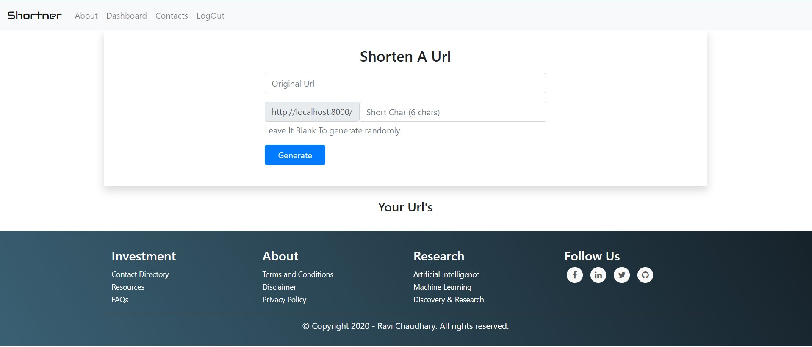

# URL SHORTNER
### An URL shortener is a website that reduces the length of your URL (Uniform Resource Locator). The idea is to minimize the web page address into something that’s easier to remember and track. 



### Technologies Used:-
    - Python
    - Django Framework
    - HTML, CSS 
    - Shorturl(Python Library)

### Getting Started:- 
Step 1:
``` 
pip install requirements.txt 
```
Step 2: 
``` 
cd url_shortner 
```
Step 3:

``` 
Python manage.py makemigrations
Python manage.py migrate
 ```

 Step 4:
 ``` 
 Python manage.py createsuperuser 
 ```

Step 5:
``` 
Python manage.py runserver 
```